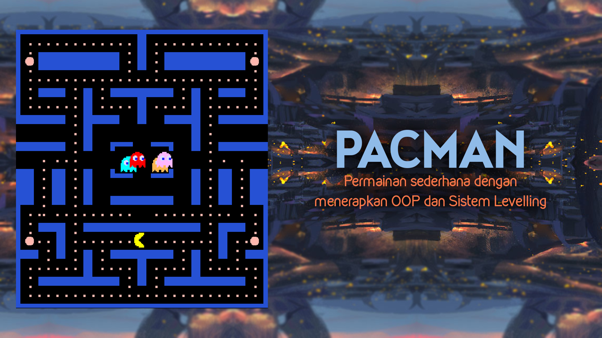
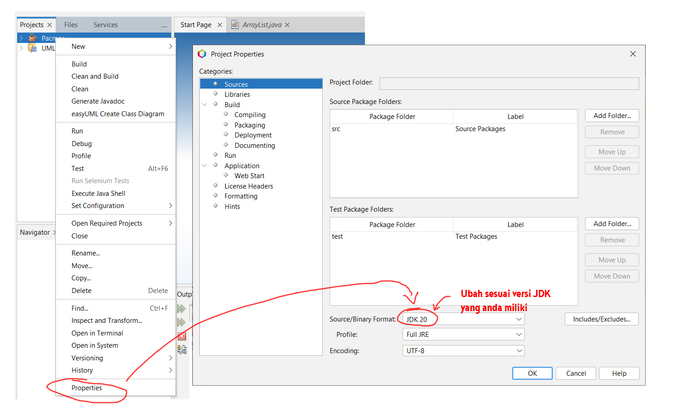

# Tugas Besar PBO Kelompok 1 : Pacman Game
Sebuah projek permainan pacman yang dibuat dalam bahasa Java.\
Berikut ini adalah fitur-fitur yang tersedia pada aplikasi permainan pacman ini:
- Pacman & Ghost (Blinky, Inky, Pinky, Clyde)
- Map Levelling System (excel file)
- Score System (Metric Scoring: Time yang diperoleh dalam menyelesaikan suatu level)
- Save / Load System

Requirements:\
IDE: Apache Netbeans IDE 19\
Java JDK Version: JDK 20\
\
**Berikut adalah cara untuk mengatasi versi JDK yang berbeda:**

\
Saving dilakukan dengan file txt, berikut adalah perinciannya:\
Game terdiri dari dua buah map, yaitu merah dan biru. Setiap map memiliki 3 buah level, yaitu level 0, level 1, dan level 2. Setiap level menyimpan satu buah file txt (red0, red1, dst atau blue0, blue1, dst) dan isi dari file ini adalah skor terbaik (waktu paling cepat yang diraih oleh player dalam menyelesaikan level ini). Setiap map memiliki 1 buah file txt (saved_level_red.txt atau saved_level_blue.txt) yang menyimpan level yang ditempuh oleh si player. Ketika player menekan tombol START NEW GAME, maka saved_level_red atau saved_level_blue tidak akan terupdate hingga player berhasil menempuh level selanjutnya. Map disimpan dalam bentuk file excel (Lokasi: "\Pacman\src\resources\level").\
\

